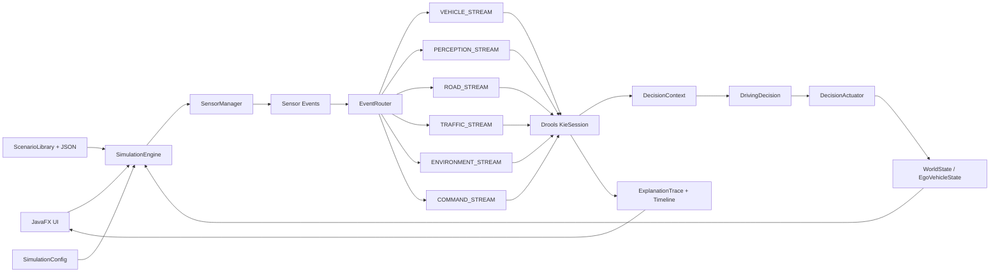

```mermaid
flowchart LR
    UI[JavaFX UI] --> ENGINE[SimulationEngine]
    SCENARIO[ScenarioLibrary + JSON] --> ENGINE
    CONFIG[SimulationConfig] --> ENGINE

    ENGINE --> SENSORS[SensorManager]
    SENSORS --> EVENTS[Sensor Events]
    EVENTS --> ROUTER[EventRouter]

    ROUTER --> EP1[VEHICLE_STREAM]
    ROUTER --> EP2[PERCEPTION_STREAM]
    ROUTER --> EP3[ROAD_STREAM]
    ROUTER --> EP4[TRAFFIC_STREAM]
    ROUTER --> EP5[ENVIRONMENT_STREAM]
    ROUTER --> EP6[COMMAND_STREAM]

    EP1 --> DROOLS[Drools KieSession]
    EP2 --> DROOLS
    EP3 --> DROOLS
    EP4 --> DROOLS
    EP5 --> DROOLS
    EP6 --> DROOLS

    DROOLS --> CTX[DecisionContext]
    CTX --> DECISION[DrivingDecision]
    DECISION --> ACT[DecisionActuator]
    ACT --> WORLD[WorldState / EgoVehicleState]
    WORLD --> ENGINE

    DROOLS --> TRACE[ExplanationTrace + Timeline]
    TRACE --> UI
```
