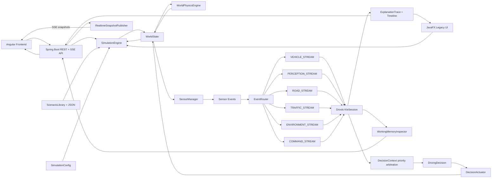

```mermaid
flowchart LR
    ANG[Angular Frontend] --> API[Spring Boot REST + SSE API]
    JAVA_FX[JavaFX Legacy UI] --> ENGINE[SimulationEngine]
    API --> ENGINE

    SCENARIO[ScenarioLibrary + JSON] --> ENGINE
    CONFIG[SimulationConfig] --> ENGINE

    ENGINE --> WORLD[WorldState]
    WORLD --> PHYSICS[WorldPhysicsEngine]
    PHYSICS --> WORLD
    WORLD --> SENSORS[SensorManager]
    SENSORS --> EVENTS[Sensor Events]
    EVENTS --> ROUTER[EventRouter]

    ROUTER --> EP1[VEHICLE_STREAM]
    ROUTER --> EP2[PERCEPTION_STREAM]
    ROUTER --> EP3[ROAD_STREAM]
    ROUTER --> EP4[TRAFFIC_STREAM]
    ROUTER --> EP5[ENVIRONMENT_STREAM]
    ROUTER --> EP6[COMMAND_STREAM]

    EP1 --> DROOLS[Drools KieSession]
    EP2 --> DROOLS
    EP3 --> DROOLS
    EP4 --> DROOLS
    EP5 --> DROOLS
    EP6 --> DROOLS

    DROOLS --> CTX[DecisionContext priority arbitration]
    CTX --> DECISION[DrivingDecision]
    DECISION --> ACT[DecisionActuator]
    ACT --> WORLD
    WORLD --> ENGINE

    DROOLS --> TRACE[ExplanationTrace + Timeline]
    DROOLS --> WM[WorkingMemoryInspector]
    TRACE --> API
    WM --> API
    TRACE --> JAVA_FX
    API --> ANG
    API --> PUBLISHER[RealtimeSnapshotPublisher]
    PUBLISHER -->|SSE snapshots| ANG
```
