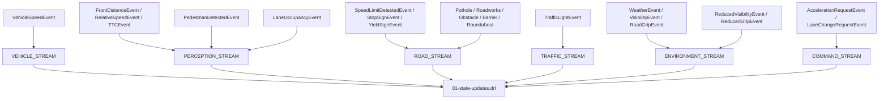

```mermaid
flowchart TD
    SPEED[VehicleSpeedEvent] --> VEHICLE_STREAM
    FRONT[FrontDistanceEvent / RelativeSpeedEvent / TTCEvent] --> PERCEPTION_STREAM
    PEDESTRIAN[PedestrianDetectedEvent] --> PERCEPTION_STREAM
    LANE_OCC[LaneOccupancyEvent] --> PERCEPTION_STREAM

    SIGNS[SpeedLimitDetectedEvent / StopSignEvent / YieldSignEvent] --> ROAD_STREAM
    HAZARDS[Pothole / Roadworks / Obstacle / Barrier / Roundabout] --> ROAD_STREAM

    TL[TrafficLightEvent] --> TRAFFIC_STREAM

    WEATHER[WeatherEvent / VisibilityEvent / RoadGripEvent] --> ENV_STREAM[ENVIRONMENT_STREAM]
    LOW_ENV[ReducedVisibilityEvent / ReducedGripEvent] --> ENV_STREAM

    CMD[AccelerationRequestEvent / LaneChangeRequestEvent] --> CMD_STREAM[COMMAND_STREAM]

    VEHICLE_STREAM --> UPDATES[01-state-updates.drl]
    PERCEPTION_STREAM --> UPDATES
    ROAD_STREAM --> UPDATES
    TRAFFIC_STREAM --> UPDATES
    ENV_STREAM --> UPDATES
    CMD_STREAM --> UPDATES
```
