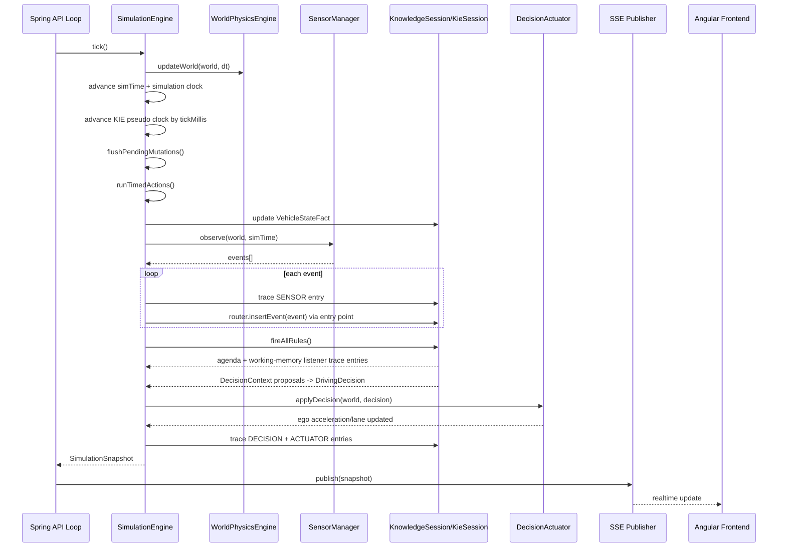

```mermaid
sequenceDiagram
    participant API as Spring API Loop
    participant ENG as SimulationEngine
    participant PHY as WorldPhysicsEngine
    participant SNS as SensorManager
    participant KIE as KnowledgeSession/KieSession
    participant ACT as DecisionActuator
    participant SSE as SSE Publisher
    participant ANG as Angular Frontend

    API->>ENG: tick()
    ENG->>PHY: updateWorld(world, dt)
    ENG->>ENG: advance simTime + simulation clock
    ENG->>ENG: advance KIE pseudo clock by tickMillis
    ENG->>ENG: flushPendingMutations()
    ENG->>ENG: runTimedActions()
    ENG->>KIE: update VehicleStateFact
    ENG->>SNS: observe(world, simTime)
    SNS-->>ENG: events[]
    loop each event
        ENG->>KIE: trace SENSOR entry
        ENG->>KIE: router.insertEvent(event) via entry point
    end
    ENG->>KIE: fireAllRules()
    KIE-->>ENG: agenda + working-memory listener trace entries
    KIE-->>ENG: DecisionContext proposals -> DrivingDecision
    ENG->>ACT: applyDecision(world, decision)
    ACT-->>ENG: ego acceleration/lane updated
    ENG->>KIE: trace DECISION + ACTUATOR entries
    ENG-->>API: SimulationSnapshot
    API->>SSE: publish(snapshot)
    SSE-->>ANG: realtime update
```
