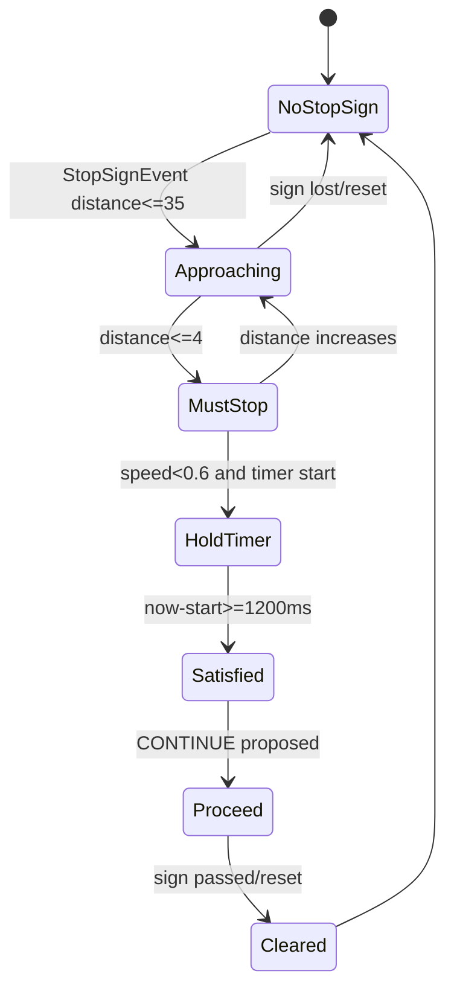

```mermaid
stateDiagram-v2
    [*] --> NoStopSign

    NoStopSign --> Approaching: StopSignEvent distance<=35
    Approaching --> MustStop: distance<=4
    MustStop --> HoldTimer: speed<0.6 and timer start
    HoldTimer --> Satisfied: now-start>=1200ms
    Satisfied --> Proceed: CONTINUE proposed
    Proceed --> Cleared: sign passed/reset
    Cleared --> NoStopSign

    Approaching --> NoStopSign: sign lost/reset
    MustStop --> Approaching: distance increases
```
