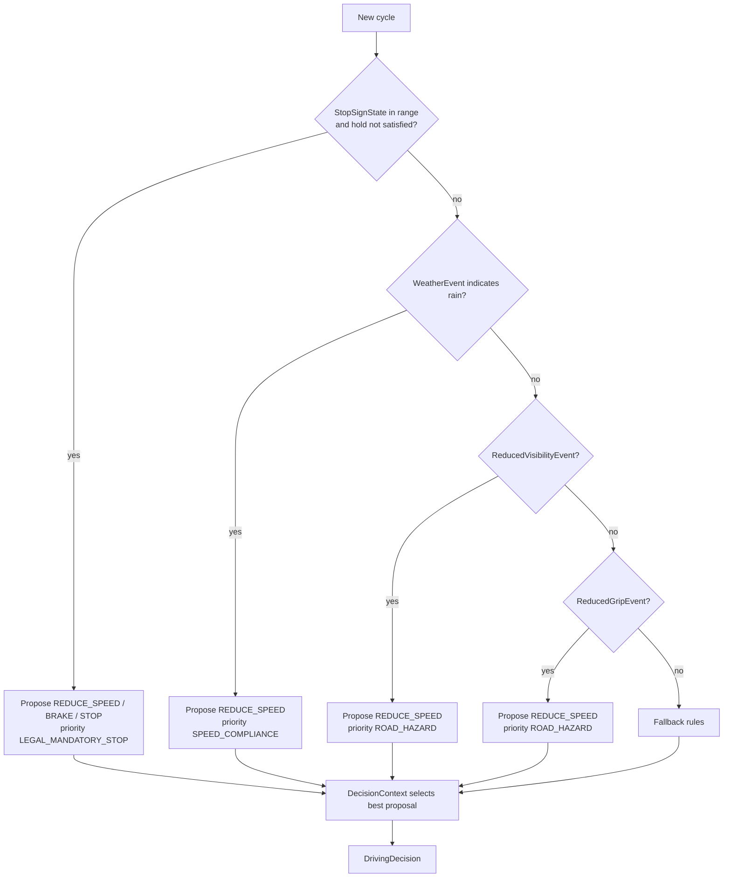

```mermaid
flowchart TD
    START[New cycle] --> STOP{StopSignState in range<br/>and hold not satisfied?}
    STOP -- yes --> STOP_DEC[Propose REDUCE_SPEED / BRAKE / STOP<br/>priority LEGAL_MANDATORY_STOP]
    STOP -- no --> WEATHER{WeatherEvent indicates rain?}

    WEATHER -- yes --> RAIN_DEC[Propose REDUCE_SPEED<br/>priority SPEED_COMPLIANCE]
    WEATHER -- no --> LOW_VIS{ReducedVisibilityEvent?}

    LOW_VIS -- yes --> VIS_DEC[Propose REDUCE_SPEED<br/>priority ROAD_HAZARD]
    LOW_VIS -- no --> LOW_GRIP{ReducedGripEvent?}

    LOW_GRIP -- yes --> GRIP_DEC[Propose REDUCE_SPEED<br/>priority ROAD_HAZARD]
    LOW_GRIP -- no --> BASE[Fallback rules]

    STOP_DEC --> PICK[DecisionContext selects best proposal]
    RAIN_DEC --> PICK
    VIS_DEC --> PICK
    GRIP_DEC --> PICK
    BASE --> PICK
    PICK --> END[DrivingDecision]
```
