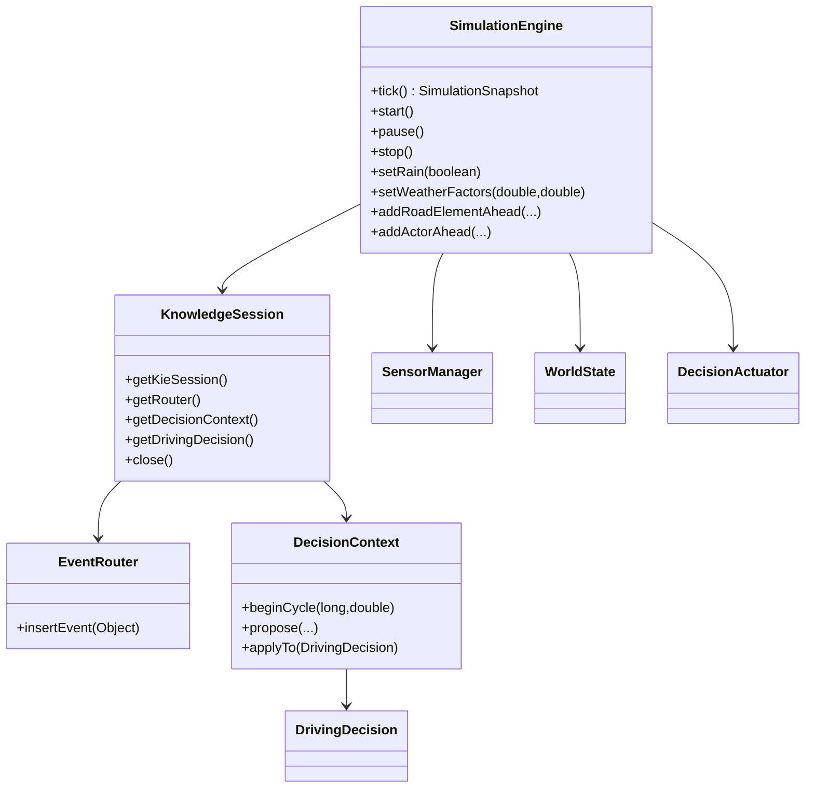

```mermaid
classDiagram
    class SimulationEngine {
      +tick() SimulationSnapshot
      +start()
      +pause()
      +stop()
      +setRain(boolean)
      +setWeatherFactors(double,double)
      +addRoadElementAhead(...)
      +addActorAhead(...)
    }

    class KnowledgeSession {
      +getKieSession()
      +getRouter()
      +getDecisionContext()
      +getDrivingDecision()
      +close()
    }

    class EventRouter {
      +insertEvent(Object)
    }

    class DecisionContext {
      +beginCycle(long,double)
      +propose(...)
      +applyTo(DrivingDecision)
    }

    class DrivingDecision
    class SensorManager
    class WorldState
    class DecisionActuator

    SimulationEngine --> KnowledgeSession
    SimulationEngine --> SensorManager
    SimulationEngine --> WorldState
    SimulationEngine --> DecisionActuator
    KnowledgeSession --> EventRouter
    KnowledgeSession --> DecisionContext
    DecisionContext --> DrivingDecision
```
