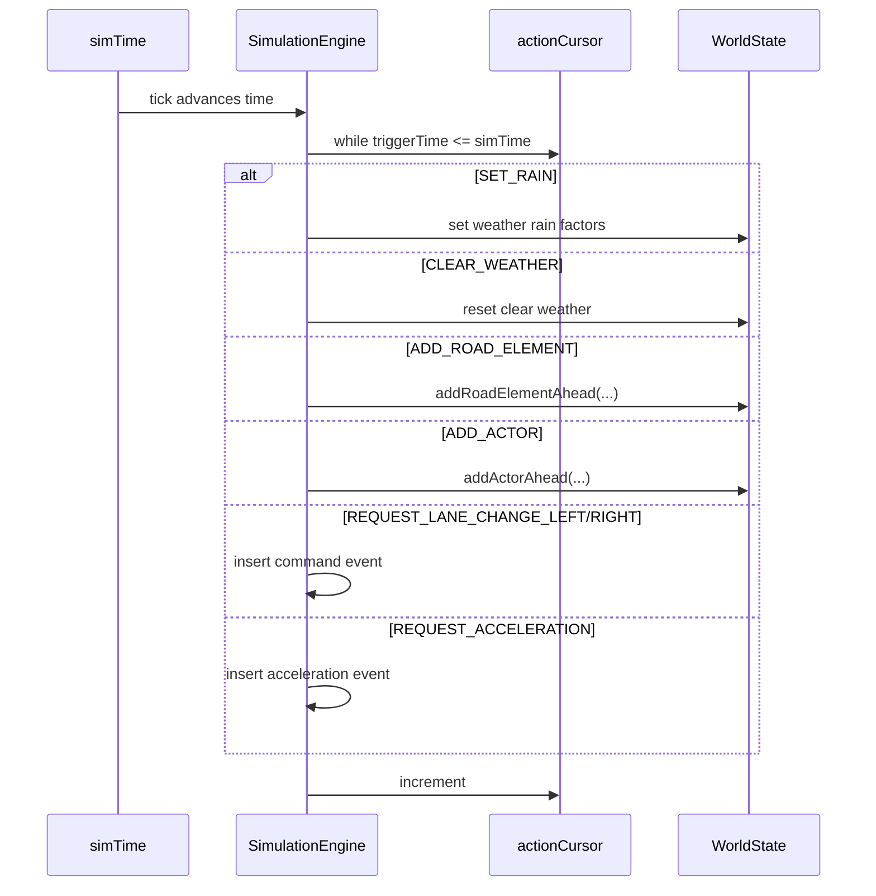

```mermaid
sequenceDiagram
    participant Clock as simTime
    participant Engine as SimulationEngine
    participant Cursor as actionCursor
    participant World as WorldState

    Clock->>Engine: tick advances time
    Engine->>Cursor: while triggerTime <= simTime
    alt SET_RAIN
        Engine->>World: set weather rain factors
    else CLEAR_WEATHER
        Engine->>World: reset clear weather
    else ADD_ROAD_ELEMENT
        Engine->>World: addRoadElementAhead(...)
    else ADD_ACTOR
        Engine->>World: addActorAhead(...)
    else REQUEST_LANE_CHANGE_LEFT/RIGHT
        Engine->>Engine: insert command event
    else REQUEST_ACCELERATION
        Engine->>Engine: insert acceleration event
    end
    Engine->>Cursor: increment
```
