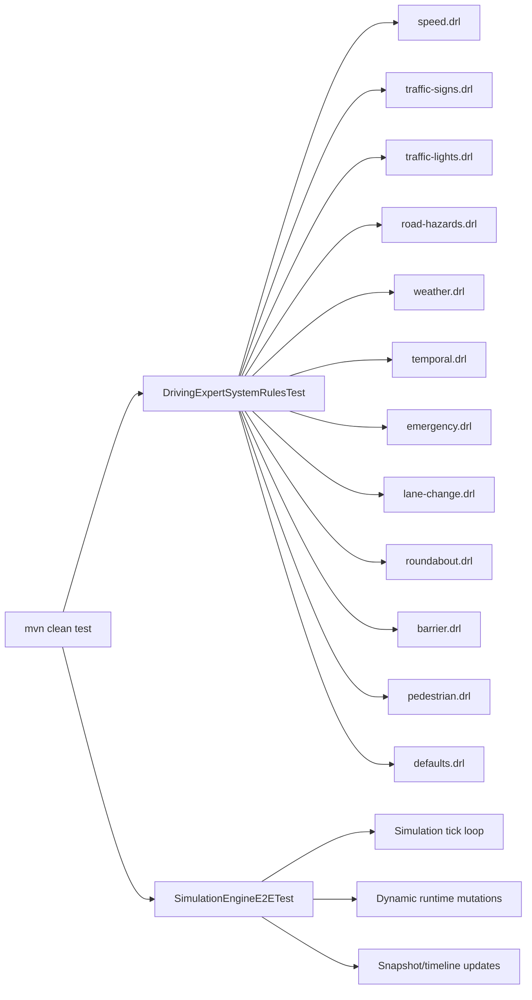

```mermaid
flowchart LR
    RULES[DrivingExpertSystemRulesTest] --> SPEED[speed.drl]
    RULES --> SIGNS[traffic-signs.drl]
    RULES --> LIGHTS[traffic-lights.drl]
    RULES --> HAZARDS[road-hazards.drl]
    RULES --> WEATHER[weather.drl]
    RULES --> TEMPORAL[temporal.drl]
    RULES --> EMERG[emergency.drl]
    RULES --> LANE[lane-change.drl]
    RULES --> ROUND[roundabout.drl]
    RULES --> BARRIER[barrier.drl]
    RULES --> PED[pedestrian.drl]
    RULES --> DEFAULTS[defaults.drl]

    E2E[SimulationEngineE2ETest] --> TICK[Simulation tick loop]
    E2E --> MUT[Dynamic runtime mutations]
    E2E --> SNAP[Snapshot/timeline updates]

    BUILD[mvn clean test] --> RULES
    BUILD --> E2E
```
