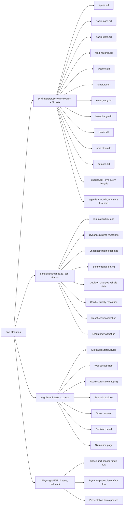

```mermaid
flowchart LR
    RULES[DrivingExpertSystemRulesTest - 21 tests] --> SPEED[speed.drl]
    RULES --> SIGNS[traffic-signs.drl]
    RULES --> LIGHTS[traffic-lights.drl]
    RULES --> HAZARDS[road-hazards.drl]
    RULES --> WEATHER[weather.drl]
    RULES --> TEMPORAL[temporal.drl]
    RULES --> EMERG[emergency.drl]
    RULES --> LANE[lane-change.drl]
    RULES --> BARRIER[barrier.drl]
    RULES --> PED[pedestrian.drl]
    RULES --> DEFAULTS[defaults.drl]
    RULES --> QUERIES[queries.drl + live query lifecycle]
    RULES --> LISTENERS[agenda + working-memory listeners]

    E2E[SimulationEngineE2ETest - 8 tests] --> TICK[Simulation tick loop]
    E2E --> MUT[Dynamic runtime mutations]
    E2E --> SNAP[Snapshot/timeline updates]
    E2E --> SENSE[Sensor range gating]
    E2E --> ACTUATE[Decision changes vehicle state]
    E2E --> PRIORITY[Conflict priority resolution]
    E2E --> RESET[Reset/session isolation]
    E2E --> EMERGENCY[Emergency actuation]

    FE[Angular unit tests - 11 tests] --> STATE[SimulationStateService]
    FE --> WSC[WebSocket client]
    FE --> ROAD[Road coordinate mapping]
    FE --> TOOLBOX[Scenario toolbox]
    FE --> ADVISOR[Speed advisor]
    FE --> DECISION[Decision panel]
    FE --> PAGE[Simulation page]

    E2EUI[Playwright E2E - 3 tests, real stack] --> SIGNFLOW[Speed limit sensor-range flow]
    E2EUI --> PEDFLOW[Dynamic pedestrian safety flow]
    E2EUI --> DEMO[Presentation demo phases]

    BUILD[mvn clean test] --> RULES
    BUILD --> E2E
    BUILD --> FE
    BUILD --> E2EUI
```
